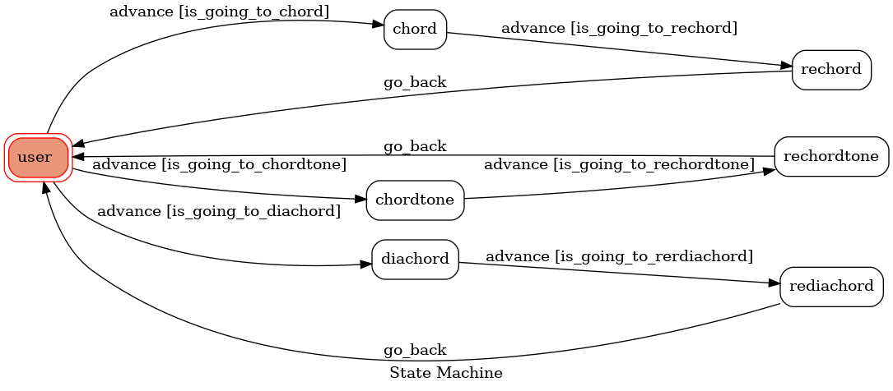

# Chord_Line_Bot
[toc]
## Introduction

讓使用者快速方便查詢常用和弦的LineBot

## Feature
- 輸入和弦代號並回傳和弦的組成音
- 輸入和弦組成音並回傳和弦名稱
- 輸入調性代號並回傳自然音階

## prerequisite
- Ubuntu 20.04
- python 3.8
- Your line account

### Install Dependency
pip3 install line-bot-sdk flask gunicorn \
transition graphviz pygraphviz -y

### Secre Data
將在Line bot網頁中產生的`LINE_CHANNEL_SECRET`和`LINE_CHANNEL_ACCESS_TOKEN`放入`.env`中

### Run Locally with ngrok
- [ngrok Download(linux)](https://ngrok.com/download)

You will get a executable file after unziping. Run it with the following command
./ngrok config add-authtoken <token>
./ngrok http <port>

then, run the server
python3 app.py

## Finite State Machine

*State說明*
- user
    - 首先讓使用者輸入欲使用功能
- menu
    - 當使用者輸入"和弦"則進入查詢和弦組成音模式
        - 輸入一個和弦，系統便會回傳和弦的組成音給使用者
	- 當使用者輸入"組成音"則進入查詢和弦模式
		- 輸入三到四個組成音，系統便會回傳和弦代號給使用者
	- 當使用者輸入"音階"則進入查詢音階模式
		- 輸入調性代號，系統會回傳自然音階給使用者
	- 結束後會回到 Initial State 讓使用者重新選擇功能

## Reference
- [TOC-Project-2020](https://github.com/NCKU-CCS/TOC-Project-2020)
- [Line-bot-sdk-python](https://github.com/line/line-bot-sdk-python/tree/master/examples/flask-echo)